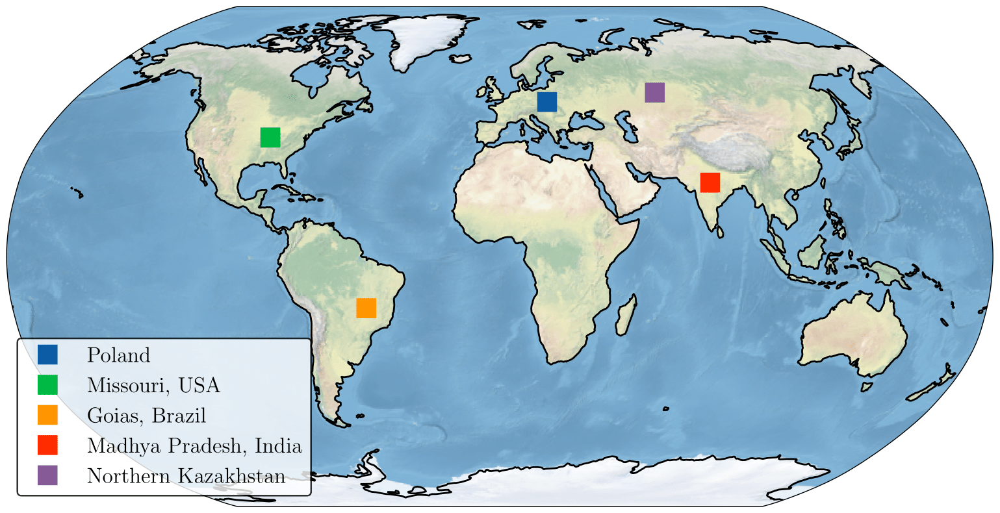

Code to test drought forecasting models from the paper ['Long-term drought prediction using deep neural networks based on geospatial weather data'](https://arxiv.org/abs/2309.06212). 

## Abstract

> The problem of high-quality drought forecasting up to a year in advance is critical for agriculture planning and insurance. Yet, it is still unsolved with reasonable accuracy due to data complexity and aridity stochasticity. We tackle drought data by introducing an end-to-end approach that adopts a spatio-temporal neural network model with accessible open monthly climate data as the input.
Our systematic research employs diverse proposed models and five distinct environmental regions as a testbed to evaluate the efficacy of the Palmer Drought Severity Index (PDSI) prediction. Key aggregated findings are the exceptional performance of a Transformer model, EarthFormer, in making accurate short-term (up to six months) forecasts. At the same time, the Convolutional LSTM excels in longer-term forecasting. Both models achieved high ROC AUC scores: 0.948 for one month ahead and 0.617 for twelve months ahead forecasts.

## Data

Datasets that were used in our experiments - **goias_pdsi.tif, madhyapradesh_pdsi.tif, missouri_pdsi.tif, northernkazakhstan_pdsi.tif, poland_pdsi.tif** - are provided in `data/raw/` folder. 
Similar geospatial data could be downloaded from [Google Earth Engine](https://earthengine.google.com/).

## Structure

0. To convert raw data from **.tif** to **.csv** please navigate to `preprocessing` folder
1. To test **Convolutional LSTM** please navigate to `pdsi_ConvLSTM` folder
2. To test **XGBoost** and **LogRegression** please navigate to `pdsi_ClassicModels` folder
3. To test **EarthFormer** please navigate to `pdsi_EarthFormer` folder
4. To test **FourCastNet** please navigate to `pdsi_FourCastNet` folder

